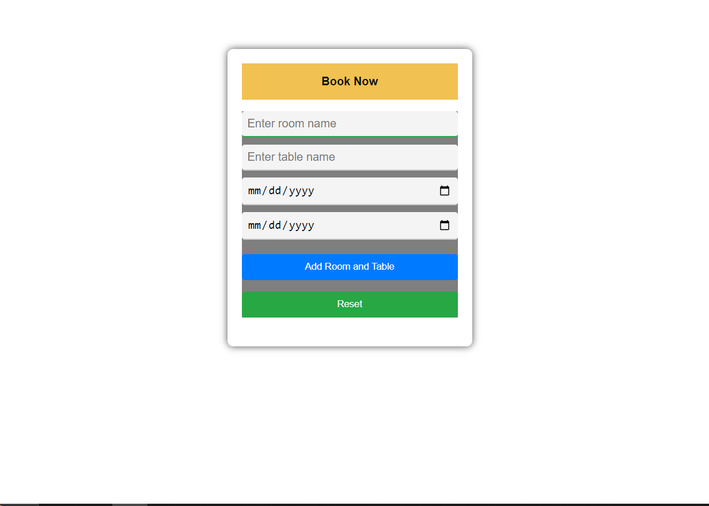

# Room Booking System

### The project is a JavaScript-based room booking system allowing users to manage rooms, tables, and bookings within a venue.

You can check it out [here](https://d-vokic.github.io/Table-Room-Booking-System/).

## Author

👤 **Duško Vokić**

* LinkedIn: [Here](https://linkedin.com/in/duško-vokić-0337a2106)
* GitHub: [@D-vokic](https://github.com/D-vokic)

This README provides an overview of the room booking system implemented in JavaScript. The system manages rooms and tables within those rooms and allows users to book available tables.

## Contents

- [Introduction](#introduction)
- [Features](#features)
- [Code Structure](#code-structure)
- [Usage](#usage)
- [Contributing](#contributing)
- [License](#license)

## Introduction

The room booking system is designed to manage multiple rooms, each containing a set of tables. Users can add rooms and tables, and book available tables within the system.

## Features

- Display rooms and tables.
- Add rooms and tables.
- Book available tables.
- Manage booking dates.

## Code Structure

The system consists of the following components:

### ViewModel

Contains data about rooms and tables.

#### Functions:

- `getElementById(id)`: Retrieves HTML elements by ID.
- `displayElement(element, displayStyle)`: Displays or hides HTML elements.
- `addEventListener(element, event, callback)`: Adds event listeners to HTML elements.
- `findFirstFreeTableInAnyRoom()`: Finds the first available table in any room.
- `showBookingForm()`: Displays the booking form.
- `hideBookingForm()`: Hides the booking form.
- `addRoom(roomName)`: Adds a room to the system.
- `isValidRoom(roomName)`: Checks if a room name is valid.
- `findRoomByName(roomName)`: Finds a room by its name.

## Code Implementation:
The code follows a systematic approach to allocate the next available unique table in the desired room, if the chosen table is already occupied. Here's the process breakdown:

1. Start by searching for tables in the range from 00 to 20.
2. If no available table is found, proceed to search in the range from A01 to A20.
3. If still no available table is found, continue searching in the range from B01 to B20.
4. This pattern repeats, proceeding through ranges from C01 to C20, D01 to D20, and so forth up to Z01 to Z20.

This logic ensures that each room gets a table with a unique name, allowing for efficient table allocation within the room booking system.

## Usage

1. Clone the repository.
2. Open index.html in a web browser.
3. Interact with the system by adding rooms, tables, and booking available tables.

## Contributing

Contributions are welcome! If you'd like to contribute to the project, please follow these steps:

1. Fork the repository.
2. Create your feature branch (`git checkout -b feature/YourFeature`).
3. Commit your changes (`git commit -am 'Add some feature'`).
4. Push to the branch (`git push origin feature/YourFeature`).
5. Create a new Pull Request.

## License

This project is licensed under the MIT License - see the [LICENSE](/LICENSE.md) file for details.

## Contact Information

You can contact me via email: vokic.dusko@gmail.com